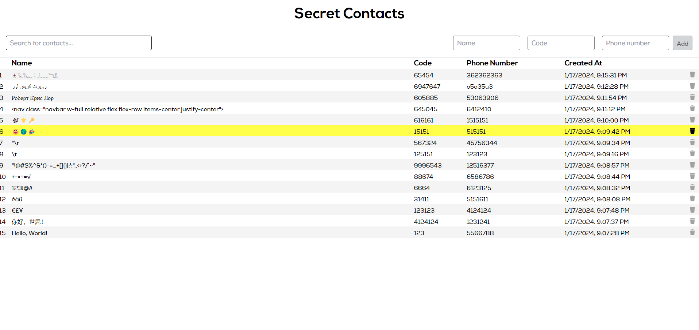

<!-- ctrl + shift + v to preview -->
# smit-homework

## SMIT Developer Internship application stage 2 homework 17.01.2024 - Secret Contacts

## **Table of Contents**
* ### [Technologies Used](#technologies-used-1)
* ### [Setup](#setup-1)


## Technologies Used
[TypeScript](https://www.typescriptlang.org/)

[Vue.js](https://vuejs.org/)

[Vite](https://vitejs.dev/)

[PostgeSQL](https://www.postgresql.org/)

[Spring Boot](https://spring.io/projects/spring-boot/)

[Docker](https://www.docker.com/)

## **Setup**

Setup local test PostgreSQL database using Docker:
```sh
chmod +x setupTestDB.sh

./setupTestDB.sh
```

Run Secret Contact API using Gradle:

```sh

cd ./secret-contacts

./gradlew bootRun --args='--spring.profiles.active=production'
```

Run the frontend:

```sh
cd client

npm install

npm run build

node server.js
```

Image of the app
